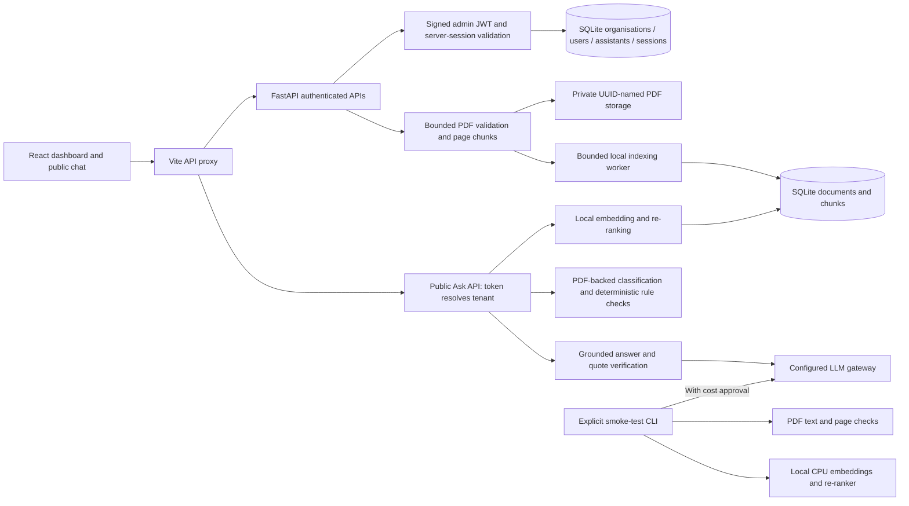

# AI Knowledge & Decision Assistant

A multi-tenant, document-grounded hackathon assistant with public chat.
See the [implementation plan](start-reading-pdf-file-generic-fountain.md) for the full scope.

Built as an independent hackathon submission for [PanScience Innovations](https://www.panscience.xyz/).
The demo policies are fictional, not PanScience's internal policies.

## Run and check the demo

Use **Windows PowerShell** from the repository root. Install Python 3.12, `uv`,
Node.js 22.14+ and npm first. Docker is not required.

```powershell
uv sync --project backend --locked
npm --prefix frontend ci
if (-not (Test-Path backend\.env)) { Copy-Item backend\.env.example backend\.env }
```

To answer *direct information, procedures or comparisons*, set `LLM_BASE_URL`
and `LLM_API_KEY` in your private `backend\.env`. The scholarship, remote-work
and travel rule checks and out-of-scope non-answers do not require a gateway.
Never commit `.env`, database files, uploaded PDFs or model cache.

Start two terminals (or the `Backend: dev` and `Frontend: dev` VS Code tasks):

```powershell
# Terminal 1
uv run --project backend uvicorn app.main:app --host 127.0.0.1 --port 8000
```

```powershell
# Terminal 2
npm --prefix frontend run dev
```

Open <http://127.0.0.1:5173/> to register/upload your own PDFs, or populate
**two new fictional demo organisations** in a third terminal:

```powershell
uv run --project backend python -m scripts.seed_demo
```

The seeder prints a different owner login and public assistant URL for each
organisation. Keep those credentials private. Open an assistant link in a
private window and try:

- “I am in year 2, my GPA is 3.6 out of 4, and I hold a sports scholarship.
  Am I eligible for the Merit Scholarship?” — a cited **not eligible** decision.
- “I am a second-year student with no existing scholarships. Can I qualify for
  the Merit Scholarship?” then “3.6” — clarification followed by a cited answer.
- “Will it rain in Northbridge tomorrow afternoon?” — explicit non-answer.
- With a configured gateway: “Compare a single hostel room with a
  twin-sharing room on price and included facilities.” — model-generated
  comparison, requiring live verification before you claim it works.

To check the external iframe, open [demo/external-site.html](demo/external-site.html)
in a browser with `?token=<Northbridge assistant token>` appended to its file URL.
Both local servers must still be running. This local demo is **not a deployed,
Internet-accessible website**.

Run the offline suite (no gateway calls):

```powershell
uv run --project backend pytest backend\tests -q
npm --prefix frontend test
npm --prefix frontend run build
```

The 23-case evaluation CLI below **does make live gateway calls** for relevant
questions, incurs possible charges and has not been run against the new
answer path. The actual 8–15 minute submission video must be recorded and
submitted separately by the project owner. No code in this repo records it.

## Current state: working local submission MVP

Implemented:
- Registration, login/logout and a protected organisation dashboard.
- Persistent SQLite accounts, bcrypt password hashes and revocable HttpOnly-cookie sessions.
- Tenant-scoped account access; another organisation's details return 404.
- Private PDF upload, document listing, delete and atomic replacement.
- Page-aware chunks, local CPU embeddings, and persistent Ready/Processing/Failed indexes.
- Tenant-scoped Ask API, source-page citations and explicit no-answer responses.
- PDF-backed deterministic eligibility/approval checks for the fictional scholarship,
  remote-work and travel policies, including a visible decision trace and missing-fact follow-up.
- Owner-only assistant link, unauthenticated public chat, and iframe embed code.
- Six-PDF two-organisation seeding and held-out evaluation commands.
- React, Vite, TypeScript and Tailwind UI with account loading/error states,
  retry, and responsive layouts.
- FastAPI health endpoint and typed backend configuration.
- OpenAI-compatible / Azure-style gateway client construction and opt-in typed-JSON smoke checks.
- CPU embedding and cross-encoder re-ranking smoke checks using FastEmbed.
- Six reproducible fictional policy PDFs, spread across two organisations and 13 pages.
- 23 held-out evaluation cases with expected facts, decisions and document/page references.
- Separate classifier datasets: 96 training examples and 24 validation examples.
- Offline tests, dependency lockfiles and VS Code tasks.

**Scope cuts:** usage dashboard, token rotation, script embed, distributed rate limiting, a
trained classifier, generic rule extraction and deployment are not implemented.
The Usage tab states this explicitly. The supported rule families parse relevant
conditions from the fictional PDFs, not arbitrary policy documents. PDF seeding
is opt-in, not automatic. Direct/procedural/comparison answers use the configured
LLM gateway; the new live answer path has not been cost-approved/tested, though
the three gateway model roles passed earlier smoke checks.

## Local URLs and configuration

- Workspace: <http://127.0.0.1:5173/> (registration, login, PDFs and assistant link)
- API health: <http://127.0.0.1:8000/api/health>
- API documentation: <http://127.0.0.1:8000/docs>

See [backend/.env.example](backend/.env.example) for all settings. The copy
command above never overwrites an existing `.env`. Both servers bind to
loopback; Vite proxies `/api` to the backend, so gateway credentials are
server-side only. Restart the backend after changing `.env`. Stop the
processes with Ctrl+C or **Terminate Task**; do not stop unrelated services.

## What the health check means

`GET /api/health` returns:

```json
{
  "status": "ok",
  "service": "knowledge-decision-assistant",
  "version": "0.1.0",
  "phase": "P5",
  "gateway_configured": false
}
```

`gateway_configured` reports the presence of the URL and key, **not** a successful
gateway connection. This endpoint never calls an LLM, loads local models, exposes
credentials, or claims that later product features work.



## Accounts and sessions

The backend initializes seven tables: `organizations`, `users`, `assistants`,
`auth_sessions`, `documents`, `chunks` and `question_logs`. Existing accounts and
PDF indexes are retained.
Registration creates the organisation, owner, assistant and session in one
transaction and signs the owner in. A canonical email belongs to one account
and one organisation in this MVP; organisation names need not be globally unique.

The default database is `backend\data\assistant.db`. An independent, random JWT
signing key is created once in `backend\data\auth-signing.key` unless an explicit
`AUTH_SECRET_KEY` is supplied. Both are ignored by Git and reused after restart.
Existing keys/databases are not overwritten. Changing the signing key invalidates
existing JWTs; do not delete local data as part of ordinary setup.

Passwords require at least 8 characters and at most 72 UTF-8 bytes, bcrypt's input
limit. The original password whitespace is preserved, but all-whitespace passwords
and null characters are rejected. Passwords are never returned in validation errors.

The admin JWT is stored only in the `kda_admin` HttpOnly, SameSite=Lax cookie,
scoped to `/api`. It has an explicit algorithm, issuer, audience, admin token type,
expiry and session ID. Each authenticated request also verifies the database
session, user and organisation. A public assistant token cannot authenticate an
admin request. No JWT is returned in JSON or stored in browser web storage.

Sessions last 8 hours by default. Logout revokes **only the current session** and
deletes its cookie; replaying that cookie is rejected, while other devices remain
signed in. Registration creates a public assistant token. Its link and iframe embed code are
visible only to that organisation's authenticated owner in the Assistant tab.

| API | Result |
|---|---|
| `POST /api/auth/register` | 201; creates an organisation/owner/assistant/session and sets the cookie |
| `POST /api/auth/login` | 200; verifies credentials and sets a new session cookie |
| `GET /api/auth/me` | Current user, organisation and session expiry; 401 when unauthenticated |
| `POST /api/auth/logout` | 204; revokes the current session and clears its cookie |
| `GET /api/organizations/{id}` | Own organisation only; another or unknown organisation returns 404 |

Registration accepts `organization_name`, `full_name`, `email`, and `password`.
Login accepts `email` and `password`. Extra fields such as `org_id` or `role` are
rejected; the server determines the organisation.

Account-changing requests require an exact allowed `Origin` header. Browser
requests provide it automatically through Vite's same-origin API proxy. CLI/API
clients must supply an allowed origin explicitly. Do not enable wildcard origins
or permissive credentialed CORS to bypass this protection.

| Setting | Default / purpose |
|---|---|
| `DATABASE_PATH` | `data/assistant.db`, relative to the backend directory |
| `AUTH_SECRET_KEY` | Empty uses the local generated key; explicit keys must be random and at least 32 bytes |
| `AUTH_SECRET_FILE` | `data/auth-signing.key`, relative to the backend directory |
| `AUTH_SESSION_MINUTES` | `480`; allowed range 1-1440 |
| `AUTH_COOKIE_SECURE` | `false` for local HTTP only; **set true for an HTTPS deployment** |
| `AUTH_ALLOWED_ORIGINS` | Explicit loopback origins for ports 5173, 4173 and 8000; replace for deployment |

Errors have the shape `{error: {code, message, request_id, fields?}}`; responses
include `X-Request-ID` and `Cache-Control: no-store`. Invalid input is 400, invalid
credentials/session 401, forbidden origin 403, duplicate email 409, and a database
or authentication-storage failure 503. Failure responses never imply a successful login.

This is local hackathon authentication, not a complete production identity system.
Email verification, password reset, invitations, authentication rate limiting and
versioned schema migrations remain production improvements. Database startup only
creates missing tables; it is not a migration/reset tool.

## PDF knowledge base

Open the Knowledge Base dashboard, select a searchable PDF, and upload it.
Limits are enforced by the server, not just the browser:

- At most **10 documents per organisation**, including Processing and Failed records.
- At most **20 physical pages** per PDF.
- At most **10,000,000 bytes** per PDF (decimal 10 MB, not 10 MiB).
- Exactly one multipart file, named `file`, per request.
- No encrypted/password-protected PDFs or documents with no extractable text.

The session and Origin are checked before multipart parsing. Actual body bytes
are bounded even without a trustworthy Content-Length. A small additional allowance
is used for multipart framing; the file itself still has the exact 10,000,000-byte limit.

PDF text is extracted page by page, whitespace-normalized, and split into up to
800-character chunks with approximately 100 characters of overlap. Chunks never
span pages. Blank/unextractable pages retain their original page numbering and
are reported in visible warnings; only text-bearing pages are indexed. **OCR and
image understanding are not implemented.**

PDF validation occurs before acceptance. A successful upload returns **202**, not
a claim that indexing has finished. A local worker embeds the chunks, validates
the model's exact output dimensions and values, and publishes the full index in
one transaction. Normalized little-endian float32 vectors, model identity and
page provenance are persisted in SQLite. A failure is visible as **Failed** with
an error; partial indexes are never searchable.

### Replacement and deletion

- Replacement keeps the existing Ready PDF/index available while the new version
  processes. It uses the same document slot and works at the 10-document limit.
- Rejected/failed replacements do not discard the old version. Successful
  replacement atomically swaps metadata and chunks, then clears its pending state.
- A document already processing/replacing cannot receive another replacement;
  deletion remains available.
- Deletion removes the record, chunks and private files. A queued/running job
  cannot recreate it afterward. File removal is rolled back if the database
  operation fails; storage errors are reported rather than counted as success.
- Interrupted indexing becomes Failed on restart. An interrupted replacement
  retains the previous Ready version and reports its failure.

The default private directory is `backend\uploads` (`UPLOADS_DIR=uploads`).
Files use random internal names; neither storage keys nor download URLs are
returned. Original filenames are display metadata only, and duplicate names
remain distinct documents. No private upload directory is mounted as static content.

| API | Result |
|---|---|
| `GET /api/documents` | Authenticated tenant's document metadata, used count and limits |
| `GET /api/documents/{id}` | Own document metadata; other/unknown IDs return 404 |
| `POST /api/documents` | Validate one multipart PDF and return 202 with its processing state |
| `PUT /api/documents/{id}` | Validate/queue a replacement, retaining the active version |
| `DELETE /api/documents/{id}` | Remove the document and its private data; return 204 |

Document responses include `warnings`, `chunk_count`, an explicit `error`, and a
separate `replacement` state. The UI polls only while work is active; refresh
errors retain any previous list as explicitly stale, never as a fabricated zero.

The browser supplies `X-Organization-ID` as an expected-workspace assertion.
It does **not** select a tenant or grant authority: the server compares it with
the authenticated session and returns `409 workspace_changed` on mismatch.
This prevents an old tab from uploading into a different organisation after
another tab changes the shared login cookie. API clients may omit the assertion
when they intentionally target whichever organisation their session represents.

### Processing limits and operational scope

This MVP runs as **one API process**, with one indexing worker, up to 20
outstanding index jobs, and at most 2 concurrent upload validations. Busy requests
return an explicit 503. Do not start multiple API workers against the same
database: startup recovery and the in-process queue assume a single owner.

The internal ready-index reader filters by tenant and Ready status, rejects
incomplete vectors/model mismatches, and reads current data without a retrieval
cache. Changing `EMBEDDING_MODEL` requires replacing/reindexing existing PDFs
before querying them with the new model.

For production, add a durable distributed queue, isolated PDF workers with
resource/time budgets, schema migrations and stronger transactional object storage.
The current parser includes its own decompression safeguards, but this is not a
general-purpose hostile-document sandbox. No PDF text is sent to the LLM gateway
during ingestion.

## Asking questions and sharing the assistant

The owner-only `GET /api/assistant` returns the organisation's existing public
token. Open `/dashboard/assistant` to copy its `/a/<token>` URL or iframe code.
Visitors do not need an admin account. `POST /api/ask` accepts:

```json
{"token": "public-assistant-token", "question": "Can I qualify?", "history": []}
```

The response includes `status` (`answered`, `needs_info` or
`insufficient_evidence`), `answer`, an optional `follow_up_question`, a
`references` array with PDF filename, physical page and exact source quote,
plus `classification`, optional `verdict` and `decision_trace`, confidence and
pipeline steps. The browser keeps at most five prior exchanges (10 history
messages) in memory, supports New chat and clears state on reload. Questions
are limited to 1,000 characters. Nothing in history is a trusted document or
policy; each request resolves the organisation from its token and retrieves
current Ready documents anew.

Search combines local query embeddings and keyword evidence with a local
re-ranker. Weak or out-of-scope support produces an explicit non-answer without
an LLM call. Supported Merit Scholarship, remote-work and travel-approval
decisions read policy sentences from that tenant's PDFs, perform independent
Boolean checks and show a trace with observed facts and rule requirements.
Missing user facts produce `needs_info`, not an invented eligibility verdict;
the scholarship stacking exception and exact thresholds are covered by tests.
This is **not** a trained classifier or a general rule extractor. Changes to
the sample policy wording may require additional parsing work.

Other direct, procedural, policy and comparison questions pass retrieved chunks
to the configured answer model. The model must quote retrieved source text;
the API rejects a generated answer with no valid source quotes rather than
presenting unsupported citations. Exact quote presence alone does not prove
the whole answer is factually correct; inspect source pages before relying on
it. Gateway outages or malformed completions return explicit non-2xx errors,
not `insufficient_evidence`. The live answer-generator path is not verified
without approval for paid requests.

Questions and outcomes are recorded server-side, but there is **no usage UI**.
The public endpoint has a **process-local** per-organisation limit of 60
questions/minute and 10 gateway-answer calls/minute (HTTP 429 when exceeded).
It resets on restart and is not shared between workers. Before Internet
deployment, add distributed throttling, abuse controls, HTTPS, secure admin cookies, observability,
and a controlled origin/frame policy. Public assistant tokens do not grant admin
access. Do not expose confidential organisation PDFs through a publicly
shared assistant.

## Stack smoke checks

### Local checks

```powershell
uv run --project backend python -m scripts.smoke_test --pdfs --local-models
```

The first local-model check downloads public ONNX model weights. Subsequent runs
reuse `backend\.cache\models`, which is ignored by Git. Document text is processed
locally; no document contents are sent to the model-download service.

The check verifies:
- Every generated page preserves its source paragraphs and expected page number.
- Embeddings have the supported dimension, finite values and nonzero norms.
- Relevant text ranks above unrelated text in both embedding similarity and
  cross-encoder scores.

Windows may warn that the Hugging Face cache cannot create symlinks. Downloads
still work using copies; administrator access is not required. Unauthenticated
public downloads can also emit a rate-limit advisory.

### Gateway checks (may incur charges)

After configuring the URL, key and model names locally, explicitly approve a run:

```powershell
uv run --project backend python -m scripts.smoke_test --gateway --allow-paid
```

This sends **one small synthetic request per distinct configured model**, covering
the fast, answer and fallback roles. It does not send PDFs, application code or
chat history. There are no automatic retries, model fallbacks, or silent response
format downgrades in this smoke test. Every failed selected check makes the
command exit nonzero. Errors omit response bodies, keys and gateway URLs.

| Setting | Purpose |
|---|---|
| `LLM_BASE_URL`, `LLM_API_KEY` | Server-side gateway connection; required for the gateway check |
| `LLM_FAST_MODEL`, `LLM_ANSWER_MODEL`, `LLM_FALLBACK_MODEL` | Gateway model or Azure deployment names |
| `LLM_API_STYLE` | `openai` (default) or `azure`; Azure also requires `LLM_API_VERSION` |
| `LLM_RESPONSE_MODE` | `json_schema` (default) or explicit `json` compatibility mode |
| `LLM_TOKEN_PARAMETER` | `max_completion_tokens` (default) or `max_tokens` |
| `LLM_MAX_OUTPUT_TOKENS`, `LLM_TIMEOUT_SECONDS` | Bounded output budget and request timeout |
| `EMBEDDING_MODEL`, `RERANKER_MODEL` | Supported FastEmbed model identifiers |
| `MODEL_THREADS`, `MODELS_CACHE_DIR` | Bounded CPU threads and backend-relative cache directory |

Both response modes are validated against a strict Pydantic schema. No temperature
parameter is sent. An invalid/incomplete completion fails rather than appearing
as a successful smoke check. The live P0 check verified OpenAI-compatible JSON
schema mode; Azure-style live connectivity has not been tested.

## Sample data

- [Policy source](sample_data/policies.yaml): three documents per organisation.
- [Generated PDFs](sample_data/pdfs): deterministic output for the upload demo and seeding script.
- [Evaluation cases](sample_data/test_questions.yaml): all six required question
  categories, multiple-condition decisions, scholarship exceptions, exact
  thresholds, clarification, comparisons and questions outside each tenant's knowledge.
- [Classifier examples](sample_data/classifier_examples.yaml): training and
  validation splits, checked for normalized duplicate questions against evaluation.

All organisations and policies are fictional demonstration data. PDF generation
checks the source text and explicit page boundaries; it does not silently let
content spill into an extra page. The page references in the evaluation fixtures
are validated against each organisation's own documents.

## Demo preparation and evaluation

Start the backend and frontend as above. To create **two new, isolated**
organisations and index all six fictional PDFs through the real upload API:

```powershell
uv run --project backend python -m scripts.seed_demo
```

The command waits for each PDF to reach Ready and prints randomly generated owner
sign-in credentials once. Keep these credentials private. Re-running it creates
new demo workspaces rather than modifying an existing user's documents. This
requires a running single-worker API; the PDFs are generated from
`sample_data/policies.yaml` if necessary.

Sign in as each owner and copy that workspace's assistant token from the
Assistant dashboard. Set the tokens in your **local terminal only** (do not save
them in source files or screenshots), then run the held-out checks:

```powershell
$env:KDA_NORTHBRIDGE_TOKEN = "<Northbridge assistant token>"
$env:KDA_ACME_TOKEN = "<Acme assistant token>"
uv run --project backend python -m scripts.run_eval
uv run --project backend python -m scripts.run_eval --all
```

The first command runs the 9 mandatory demo questions; `--all` runs all 23
held-out questions. The runner checks HTTP success, response status, eligibility
verdict, required document/page citations, expected Boolean rule checks and
missing-fact names, forbidden exact claims and the presence of a decision trace
for answered structured questions. It rejects citations outside that
organisation's fixture documents/pages. **It does not
prove complete factual accuracy or that each cited passage supports every
sentence**; review answer text and source pages separately. Live Ask requests
send retrieved passages/questions to the configured LLM gateway and may incur
charges. Dataset validation and unit tests use no live gateway.
An offline end-to-end run with real sample PDFs, local search models and a
test answer generator passed all 9 mandatory demos and 22/23 fixtures. The
remaining leave-comparison case lacked its required page-1 citation; a real
gateway model's behaviour on that case is unverified.

To demonstrate embedding on an unrelated page, open
[the external-site example](demo/external-site.html) in a browser and append
`?token=<your assistant token>` to its file URL. The example loads the public
`http://127.0.0.1:5173/a/<token>` route in an iframe; both dev servers must be
running. For a deployed site, replace the localhost URL with your deployed
frontend origin.

Suggested 8–15 minute video walkthrough (the video must be recorded and
submitted by the project owner):
1. Register/sign in and show the private organisation dashboard.
2. Upload sample PDFs and wait for Ready; show page count, replacement and limits.
3. Open the public assistant link in a private window and ask the Merit
   Scholarship sports/need-based eligibility questions; inspect the rule checks
   and document/page citations.
4. Ask an Acme remote-work eligibility question and compare a pair of policies.
5. Ask an out-of-scope/weather question; show the explicit non-answer.
6. Show the iframe in the external demo page, then sign in to the other
   organisation and demonstrate that its assistant cannot cite the first one's PDFs.
7. Show the test output, architecture, local-run instructions and known limitations.

## Verification commands

Run from the repository root:

```powershell
uv run --project backend pytest backend\tests -q
Push-Location backend
uv run ruff check app tests
uv run ruff format --check app tests
Pop-Location
uv run --project backend ruff check --config backend\pyproject.toml scripts\seed_demo.py scripts\run_eval.py
uv run --project backend ruff format --check --config backend\pyproject.toml scripts\seed_demo.py scripts\run_eval.py
npm --prefix frontend test
npm --prefix frontend run build
```

The tests use isolated databases and fake answer generators; no gateway charges
occur in the unit suite. The production build includes TypeScript checking.
On 27 September 2026, **168 backend** and **114 frontend** tests, Python
lint/format, and the frontend build passed. Real local PDF indexing for both
organisations and browser checks of the public iframe, scholarship decision,
GPA clarification, weather non-answer and cross-tenant isolation also passed.
The current Starlette test client emits a non-blocking upstream deprecation
warning; Node 22 may warn about experimental TypeScript stripping.
