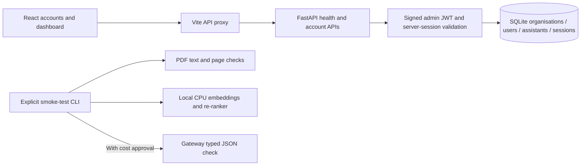

# AI Knowledge & Decision Assistant

A multi-tenant, document-grounded assistant being built **one phase at a time**.
See the [implementation plan](start-reading-pdf-file-generic-fountain.md) for the full scope.

Built as a hackathon submission for [PanScience Innovations](https://www.panscience.xyz/).
The demo policies are fictional, not PanScience's internal policies.

## Current state: P1 organisation accounts

Implemented:
- Registration, login/logout and a protected organisation dashboard.
- Persistent SQLite accounts, bcrypt password hashes and revocable HttpOnly-cookie sessions.
- Tenant-scoped account access; another organisation's details return 404.
- React, Vite, TypeScript and Tailwind UI with account loading/error states,
  retry, and responsive layouts.
- FastAPI health endpoint and typed backend configuration.
- OpenAI-compatible / Azure-style gateway client construction and opt-in typed-JSON smoke checks.
- CPU embedding and cross-encoder re-ranking smoke checks using FastEmbed.
- Six reproducible fictional policy PDFs, spread across two organisations and 13 pages.
- 23 held-out evaluation cases with expected facts, decisions and document/page references.
- Separate classifier datasets: 96 training examples and 24 validation examples.
- Offline tests, dependency lockfiles and VS Code tasks.

**Not implemented yet:** PDF-upload APIs, tenant-scoped document retrieval, the
decision engine, chat, assistant publishing, or embedding the assistant. The PDFs are
fixtures, not an ingested knowledge base. The classifier dataset is not yet a
trained classifier. The final live-answer evaluation belongs to later phases.
The Knowledge Base / Assistant / Usage tabs clearly identify their later-phase
features; they do not show fabricated usage counts or working upload controls.

## Local setup (Windows / PowerShell)

Prerequisites: Python 3.12, `uv`, and Node.js 22.14+ with npm. Docker is not required.
Run these commands from the repository root:

```powershell
uv sync --project backend --locked
npm --prefix frontend ci
if (-not (Test-Path backend\.env)) { Copy-Item backend\.env.example backend\.env }
uv run --project backend python -m scripts.make_sample_pdfs
uv run --project backend python -m scripts.smoke_test --pdfs
```

Open [backend/.env.example](backend/.env.example) to see the configuration options,
then edit your local `backend\.env`. Enter the gateway URL and API key **locally**;
never put credentials in chat, source code, frontend configuration, screenshots,
or commits. Both values may remain blank while working on the local foundation.
The copy command above does not overwrite an existing local configuration.

### Start the application

Use **Tasks: Run Task** in VS Code:
1. `Backend: dev`
2. `Frontend: dev`

Alternatively, use two PowerShell terminals at the repository root:

```powershell
# Terminal 1
uv run --project backend uvicorn app.main:app --host 127.0.0.1 --port 8000
```

```powershell
# Terminal 2
npm --prefix frontend run dev
```

- Workspace: <http://127.0.0.1:5173/>
- Register: <http://127.0.0.1:5173/register>
- Sign in: <http://127.0.0.1:5173/login>
- API health: <http://127.0.0.1:8000/api/health>
- API documentation: <http://127.0.0.1:8000/docs>

Both servers bind to loopback. Vite proxies `/api` to the backend; gateway secrets
never reach the frontend. Stop these processes with their terminal's Ctrl+C or
VS Code's **Terminate Task** command. Restart the backend after editing its
configuration. Do not stop unrelated processes if a port is occupied.

## What the health check means

`GET /api/health` returns:

```json
{
  "status": "ok",
  "service": "knowledge-decision-assistant",
  "version": "0.1.0",
  "phase": "P1",
  "gateway_configured": false
}
```

`gateway_configured` reports the presence of the URL and key, **not** a successful
gateway connection. This endpoint never calls an LLM, loads local models, exposes
credentials, or claims that later product features work.



## Accounts and sessions

On first startup, the backend creates four tables: `organizations`, `users`,
`assistants`, and `auth_sessions`. Registration creates all four records in one
transaction and signs the owner in. A canonical email belongs to one account
and one organisation in this MVP; organisation names need not be globally unique.

The default database is `backend\data\assistant.db`. An independent, random JWT
signing key is created once in `backend\data\auth-signing.key` unless an explicit
`AUTH_SECRET_KEY` is supplied. Both are ignored by Git and reused after restart.
Existing keys/databases are not overwritten. Changing the signing key invalidates
existing JWTs; do not delete local data as part of ordinary setup.

Passwords require at least 8 characters and at most 72 UTF-8 bytes, bcrypt's input
limit. The original password whitespace is preserved, but all-whitespace passwords
and null characters are rejected. Passwords are never returned in validation errors.

The admin JWT is stored only in the `kda_admin` HttpOnly, SameSite=Lax cookie,
scoped to `/api`. It has an explicit algorithm, issuer, audience, admin token type,
expiry and session ID. Each authenticated request also verifies the database
session, user and organisation. A public assistant token cannot authenticate an
admin request. No JWT is returned in JSON or stored in browser web storage.

Sessions last 8 hours by default. Logout revokes **only the current session** and
deletes its cookie; replaying that cookie is rejected, while other devices remain
signed in. Registration creates an assistant token, but its publishing/link UI
is intentionally deferred to P3.

| API | Result |
|---|---|
| `POST /api/auth/register` | 201; creates an organisation/owner/assistant/session and sets the cookie |
| `POST /api/auth/login` | 200; verifies credentials and sets a new session cookie |
| `GET /api/auth/me` | Current user, organisation and session expiry; 401 when unauthenticated |
| `POST /api/auth/logout` | 204; revokes the current session and clears its cookie |
| `GET /api/organizations/{id}` | Own organisation only; another or unknown organisation returns 404 |

Registration accepts `organization_name`, `full_name`, `email`, and `password`.
Login accepts `email` and `password`. Extra fields such as `org_id` or `role` are
rejected; the server determines the organisation.

Account-changing requests require an exact allowed `Origin` header. Browser
requests provide it automatically through Vite's same-origin API proxy. CLI/API
clients must supply an allowed origin explicitly. Do not enable wildcard origins
or permissive credentialed CORS to bypass this protection.

| Setting | Default / purpose |
|---|---|
| `DATABASE_PATH` | `data/assistant.db`, relative to the backend directory |
| `AUTH_SECRET_KEY` | Empty uses the local generated key; explicit keys must be random and at least 32 bytes |
| `AUTH_SECRET_FILE` | `data/auth-signing.key`, relative to the backend directory |
| `AUTH_SESSION_MINUTES` | `480`; allowed range 1-1440 |
| `AUTH_COOKIE_SECURE` | `false` for local HTTP only; **set true for an HTTPS deployment** |
| `AUTH_ALLOWED_ORIGINS` | Explicit loopback origins for ports 5173, 4173 and 8000; replace for deployment |

Errors have the shape `{error: {code, message, request_id, fields?}}`; responses
include `X-Request-ID` and `Cache-Control: no-store`. Invalid input is 400, invalid
credentials/session 401, forbidden origin 403, duplicate email 409, and a database
or authentication-storage failure 503. Failure responses never imply a successful login.

This is local hackathon authentication, not a complete production identity system.
Email verification, password reset, invitations, authentication rate limiting and
versioned schema migrations remain production improvements. Database startup only
creates missing tables; it is not a migration/reset tool.

## Stack smoke checks

### Local checks

```powershell
uv run --project backend python -m scripts.smoke_test --pdfs --local-models
```

The first local-model check downloads public ONNX model weights. Subsequent runs
reuse `backend\.cache\models`, which is ignored by Git. Document text is processed
locally; no document contents are sent to the model-download service.

The check verifies:
- Every generated page preserves its source paragraphs and expected page number.
- Embeddings have the supported dimension, finite values and nonzero norms.
- Relevant text ranks above unrelated text in both embedding similarity and
  cross-encoder scores.

Windows may warn that the Hugging Face cache cannot create symlinks. Downloads
still work using copies; administrator access is not required. Unauthenticated
public downloads can also emit a rate-limit advisory.

### Gateway checks (may incur charges)

After configuring the URL, key and model names locally, explicitly approve a run:

```powershell
uv run --project backend python -m scripts.smoke_test --gateway --allow-paid
```

This sends **one small synthetic request per distinct configured model**, covering
the fast, answer and fallback roles. It does not send PDFs, application code or
chat history. There are no automatic retries, model fallbacks, or silent response
format downgrades in this smoke test. Every failed selected check makes the
command exit nonzero. Errors omit response bodies, keys and gateway URLs.

| Setting | Purpose |
|---|---|
| `LLM_BASE_URL`, `LLM_API_KEY` | Server-side gateway connection; required for the gateway check |
| `LLM_FAST_MODEL`, `LLM_ANSWER_MODEL`, `LLM_FALLBACK_MODEL` | Gateway model or Azure deployment names |
| `LLM_API_STYLE` | `openai` (default) or `azure`; Azure also requires `LLM_API_VERSION` |
| `LLM_RESPONSE_MODE` | `json_schema` (default) or explicit `json` compatibility mode |
| `LLM_TOKEN_PARAMETER` | `max_completion_tokens` (default) or `max_tokens` |
| `LLM_MAX_OUTPUT_TOKENS`, `LLM_TIMEOUT_SECONDS` | Bounded output budget and request timeout |
| `EMBEDDING_MODEL`, `RERANKER_MODEL` | Supported FastEmbed model identifiers |
| `MODEL_THREADS`, `MODELS_CACHE_DIR` | Bounded CPU threads and backend-relative cache directory |

Both response modes are validated against a strict Pydantic schema. No temperature
parameter is sent. An invalid/incomplete completion fails rather than appearing
as a successful smoke check. The live P0 check verified OpenAI-compatible JSON
schema mode; Azure-style live connectivity has not been tested.

## Sample data

- [Policy source](sample_data/policies.yaml): three documents per organisation.
- [Generated PDFs](sample_data/pdfs): deterministic output, ready for later upload demos.
- [Evaluation cases](sample_data/test_questions.yaml): all six required question
  categories, multiple-condition decisions, scholarship exceptions, exact
  thresholds, clarification, comparisons and questions outside each tenant's knowledge.
- [Classifier examples](sample_data/classifier_examples.yaml): training and
  validation splits, checked for normalized duplicate questions against evaluation.

All organisations and policies are fictional demonstration data. PDF generation
checks the source text and explicit page boundaries; it does not silently let
content spill into an extra page. The page references in the evaluation fixtures
are validated against each organisation's own documents.

## Verification commands

Run from the repository root:

```powershell
uv run --project backend pytest backend\tests -q
uv run --project backend ruff check --config backend\pyproject.toml backend\app backend\tests scripts
uv run --project backend ruff format --check --config backend\pyproject.toml backend\app backend\tests scripts
npm --prefix frontend test
npm --prefix frontend run build
```

The auth tests use temporary databases and separate test-only signing keys.
They cover registration rollback/concurrency, password boundaries, signature and
claim validation, origin protection, current-session revocation, restart persistence,
and account-level tenant isolation. Document-level isolation tests follow in P2/P3.
The backend gateway and frontend API tests use mocked HTTP transports and do not
incur gateway charges. Frontend builds include TypeScript checking.
The `Frontend: build` VS Code task runs the same build command.

P0 checkpoint verified on 27 September 2026:
- **33 backend tests** and **15 frontend tests** passed.
- Python lint/format checks and frontend TypeScript/production build passed.
- Six PDF fixtures and their 13 page references passed validation.
- Local CPU models produced 384-dimensional embeddings and correct relevant-text ordering.
- All three configured gateway roles returned validated typed JSON, one request each.
- The real browser/API integration, a simulated HTTP failure followed by retry,
  and desktop/mobile layouts (1440 px / 390 px) passed.

P1 checkpoint verified on 27 September 2026:
- **84 backend tests** and **55 frontend tests** passed.
- Python lint/format checks, TypeScript checking and the production frontend build passed.
- Browser registration, automatic sign-in, dashboard navigation, reload persistence,
  wrong-password feedback, sign-out and protected-route redirects passed.
- Simulated session-verification and sign-out outages showed explicit errors;
  retries recovered without pretending a failed request succeeded.
- The real frontend proxy preserved private cookie flags and authenticated
  organisation access. Logout from a separate client did not revoke the browser's session.
- Desktop/mobile dashboard layouts (1440 px / 390 px) had no horizontal overflow.
- No gateway calls were needed for P1.

The current Starlette test client emits a non-blocking upstream deprecation warning
about its `httpx` transport; assertions still pass. Node's built-in TypeScript
stripping can emit an experimental warning on Node 22.

## Manual phase checkpoints

All staging, branch selection, commits and pushes are performed **manually by the
project owner**. P0 was committed and pushed as `c22d4df`. P1 stops for review and a
manual commit before P2 begins.
Suggested P1 message:

```text
feat(auth): organisation registration, login, dashboard shell
```

Do not include the local environment file, model cache, virtual environment,
uploads, databases, dependency-install directories, or the assignment PDF in a
commit. The repository ignore rules cover these paths while retaining sample
PDFs, environment placeholders and dependency lockfiles.
